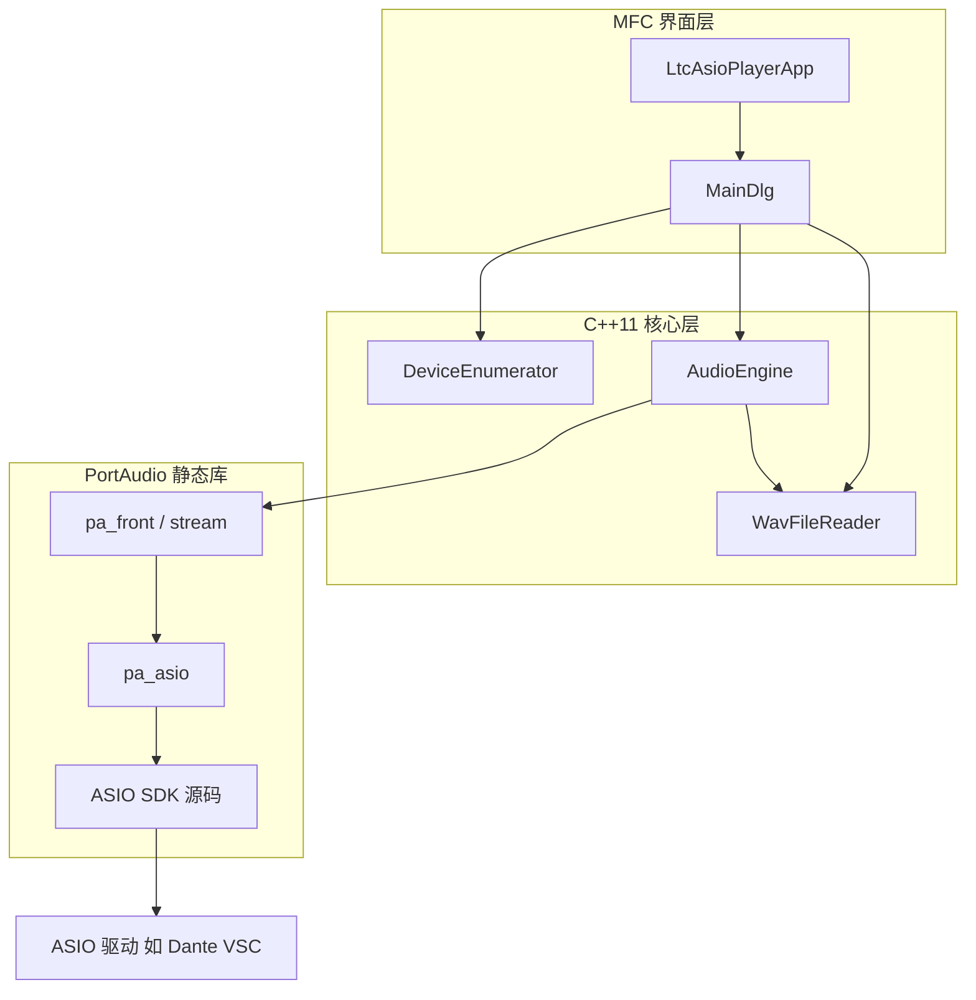

# 架构与模块

## 1. 总体架构



- **界面层**：用户操作、日志、文件对话框；通过 `PostMessage` 接收播放结束通知。  
- **核心层**：与 MFC 无关的 C++11 模块。  
- **PortAudio 层**：静态库 `portaudio_static`，仅编译 ASIO Host API 及 Windows 平台公共代码。  

## 2. 目录与源文件

```
src/
  app/
    LtcAsioPlayerApp.cpp/h    # CWinApp，InitInstance → 主对话框 DoModal
  ui/
    MainDlg.cpp/h             # 对话框、消息映射、控件逻辑
  audio/
    WavFileReader.cpp/h       # WAV 解析 → interleaved float
    DeviceEnumerator.cpp/h    # Pa_Initialize、ASIO 设备列表、缓冲区查询
    AudioEngine.cpp/h         # Pa_OpenStream、回调、循环/停止
res/
  LtcAsioPlayer.rc            # 对话框模板
  resource.h                  # 控件 ID、WM_PLAYBACK_COMPLETE
```

## 3. 模块说明

### 3.1 `WavFileReader`

**职责**：从磁盘读取 WAV，解码为 **交错排列的 float 样本**（`paFloat32` 兼容）。

| 接口 | 说明 |
|------|------|
| `Load(wpath, errorOut)` | 解析 RIFF；支持 16/24/32 PCM 与 32-bit float |
| `sampleRate()` | Hz |
| `channelCount()` | 1 或 2 |
| `frameCount()` | 每声道帧数 |
| `samples()` | `vector<float>`，长度 = `frameCount * channelCount` |

24-bit PCM 按 3 字节有符号扩展归一化到 `[-1, 1]`。详见 [音频数据处理.md](音频数据处理.md) §3.1。

### 3.2 `DeviceEnumerator`

**职责**：管理 PortAudio 全局初始化与 ASIO 设备信息缓存。

| 方法 | 说明 |
|------|------|
| `Initialize` | `Pa_Initialize()`；收集 `paASIO` 且 `maxOutputChannels > 0` 的设备 |
| `Shutdown` | `Pa_Terminate()` |
| `GetBufferSizes` | 封装 `PaAsio_GetAvailableBufferSizes`，展开 min/max/granularity 为可选列表 |
| `devices()` | `AsioDeviceInfo` 向量（索引、名称、通道数、默认采样率） |

Dante 默认项：名称子串匹配 `"Dante Virtual Soundcard"`。

### 3.3 `AudioEngine`

**职责**：打开输出流、在回调中写入样本、处理循环与结束通知。

**配置结构 `AudioEngineConfig`**：

| 字段 | 含义 |
|------|------|
| `deviceIndex` | PortAudio 全局设备索引 |
| `outputChannel` | 单声道时 ASIO `channelSelectors[0]` |
| `framesPerBuffer` | `Pa_OpenStream` 的帧缓冲大小 |
| `loopPlayback` | 是否循环 |

**ASIO 扩展**（参考 `paex_mono_asio_channel_select.c`）：

```cpp
PaAsioStreamInfo asioInfo;
asioInfo.flags = paAsioUseChannelSelectors;
asioInfo.channelSelectors = ...;  // 单声道: [outputChannel]；立体声: [0,1]
outputParameters.hostApiSpecificStreamInfo = &asioInfo;
```

**回调逻辑**：

- 使用 `std::atomic<uint64_t>` 记录播放位置  
- 写满 `framesPerBuffer` 帧；到末尾时若循环则归零，否则 `return paComplete` 并触发 `CompletionCallback`  
- `CompletionCallback` 内由 UI 线程 `PostMessage(WM_PLAYBACK_COMPLETE)`  

**停止**：`Pa_StopStream` → `Pa_CloseStream`，清空样本与回调，避免与 UI 竞态。

WAV 解码、`SampleToFloat`（含 24-bit 符号扩展）与 `StreamCallback` 拷贝逻辑详见 [音频数据处理.md](音频数据处理.md)。

### 3.4 `CMainDlg`（MFC）

**职责**：绑定控件、调用上述模块、维护播放状态 UI。

| 消息 / 处理 | 行为 |
|-------------|------|
| `OnInitDialog` | 初始化设备列表、缓冲区、通道 Spin |
| `OnCbnSelchangeDevice` | 刷新缓冲区与通道范围 |
| `OnBnClickedPlay` | `WavFileReader::Load` → `AudioEngine::Start` |
| `OnBnClickedStop` | `AudioEngine::Stop` |
| `OnPlaybackComplete` | 播完复位控件 |
| `OnBnClickedAsioPanel` | `PaAsio_ShowControlPanel(device, m_hWnd)` |
| `OnDestroy` | `Stop` + `DeviceEnumerator::Shutdown` |

## 4. 线程模型

| 线程 | 工作 |
|------|------|
| UI 主线程 | 对话框消息、加载 WAV、启停流、写日志 |
| PortAudio/ASIO 回调线程 | 从 `samples` 拷贝到 `outputBuffer`；**禁止** malloc、MFC、阻塞 I/O |

播放结束通过 **异步 PostMessage** 回到 UI 线程执行 `Stop` 与界面复位，避免在回调中直接操作 MFC 控件。

## 5. PortAudio 集成要点

- 全进程一次 `Pa_Initialize` / `Pa_Terminate`（由 `DeviceEnumerator` 持有）  
- 打开流使用 WAV 文件采样率，而非强制设备默认率  
- 静态链接 `portaudio_static`，依赖 WinMM、`ole32`、`uuid` 等（由 PortAudio CMake 传递）  
- 应用编译定义 `PA_USE_ASIO=1` 以使用 `pa_asio.h` 扩展  

## 6. 扩展建议（未实现）

若后续需要增强，可在保持分层前提下考虑：

- 播放进度条（UI 定时器读 atomic 位置）  
- 音量增益（回调内乘系数）  
- 设备列表刷新按钮（`Pa_Terminate` 后重新 `Initialize`）  
- 配置文件保存上次设备与通道  
