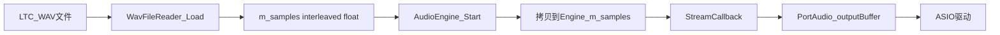
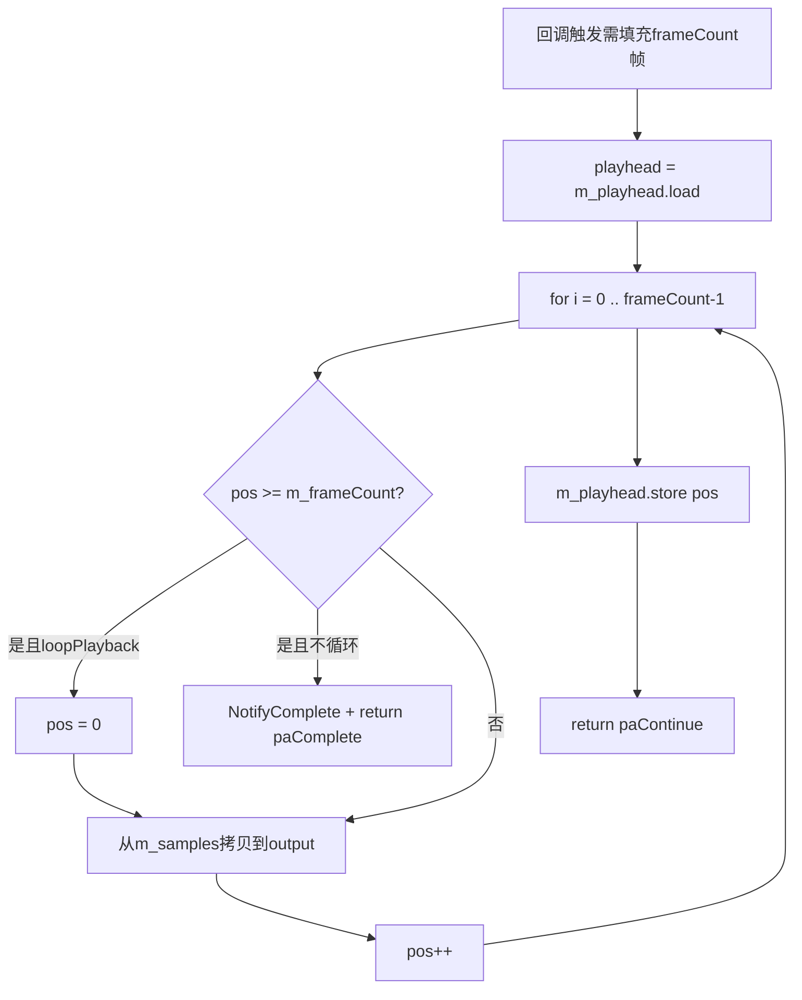

# 音频数据处理

本文说明 LTC（或其它 PCM）WAV 文件如何被读取、解码为 float，以及 PortAudio 回调如何将样本送往 ASIO 驱动。对应源码：

- [`src/audio/WavFileReader.cpp`](../src/audio/WavFileReader.cpp) — `Load`、`SampleToFloat`
- [`src/audio/AudioEngine.cpp`](../src/audio/AudioEngine.cpp) — `Start`、`StreamCallback`

## 1. 端到端数据流



处理分为两个阶段：

| 阶段 | 线程 | 函数 | 工作 |
|------|------|------|------|
| 预加载解码 | UI 主线程 | `WavFileReader::Load` | 读盘、解析 WAV、转为 float 数组 |
| 实时播放 | PortAudio/ASIO 回调线程 | `AudioEngine::StreamCallback` | 按播放头从内存拷贝到输出缓冲 |

`AudioEngine::Start` 在 UI 线程执行：将 `WavFileReader` 解码结果**拷贝**到引擎内部的 `m_samples`，再调用 `Pa_OpenStream` 注册回调。回调中**不再读盘或解码**，只做内存拷贝，以满足实时性要求。

## 2. `WavFileReader::Load` 解读

`Load(const std::wstring& path, std::string* errorOut)` 在成功时填充 `m_sampleRate`、`m_channelCount`、`m_frameCount`、`m_samples`。

### 2.1 执行步骤

| 步骤 | 代码行为 |
|------|----------|
| 打开文件 | 宽字符路径经 `WideToUtf8` 转为 UTF-8，用 `std::ifstream` 以二进制模式打开 |
| RIFF 头 | 读取 8 字节：校验 `id == "RIFF"`，再读 4 字节校验 `"WAVE"` |
| Chunk 扫描 | 循环读取 `{ id[4], size }`；遇 `fmt ` 解析格式，遇 `data` 读入 PCM 字节，其余 chunk 跳过；若 `size` 为奇数则再跳过 1 字节（RIFF 对齐规则） |
| 格式校验 | `wFormatTag == 1`（PCM）或 `3`（IEEE float）；声道数仅允许 1 或 2 |
| 帧大小 | 24-bit：`bytesPerSample = 3`；其它位深：`bitsPerSample / 8`；`frameSize = numChannels * bytesPerSample` |
| 对齐检查 | `data` 字节数须能被 `frameSize` 整除 |
| 解码循环 | 对每个 `(frame, channel)` 调用 `SampleToFloat`，写入 `m_samples[frame * ch + c]` |

### 2.2 输出：`m_samples` 交错布局

`m_samples` 为 **interleaved（交错）** float 数组，与 PortAudio `paFloat32` 输出布局一致：

- **单声道**：`[s0, s1, s2, ...]`（每元素为一帧）
- **立体声**：`[L0, R0, L1, R1, ...]`（每两元素为一帧）

索引公式：

```text
index = frameIndex * channelCount + channelIndex
```

样本值经归一化后约在 `[-1.0, 1.0]` 范围内。

## 3. `SampleToFloat` 与位深转换

`SampleToFloat(const uint8_t* src, int bitsPerSample, bool isFloat)` 将单个样本的原始字节转为 `float`。

| bitsPerSample | wFormatTag | 处理方式 | 除数 |
|---------------|------------|----------|------|
| 16 | 1 (PCM) | `memcpy` 为 `int16`（小端） | 32768（2^15） |
| **24** | 1 (PCM) | 3 字节小端拼 `int32` + 符号扩展 | 8388608（2^23） |
| 32 | 1 (PCM) | `memcpy` 为 `int32` | 2147483648（2^31） |
| 32 | 3 (float) | `memcpy` 为 `float` | 无（已是浮点） |

### 3.1 24-bit PCM 详解

WAV 中 24-bit PCM 每个样本占 **3 字节**，按**小端**存储。单声道下一帧的字节顺序为：

```text
[ LSB = src[0] ] [ MID = src[1] ] [ MSB = src[2]，最高位为符号位 ]
```

对应源码：

```cpp
std::int32_t v = (src[0]) | (src[1] << 8) | (src[2] << 16);
if(v & 0x800000)
    v |= 0xFF000000;
return static_cast<float>(v) / 8388608.0f;
```

**分步说明：**

1. **小端拼接**  
   `src[0]` 为最低 8 位，`src[1]` 为中间 8 位，`src[2]` 为最高 8 位（含符号位，即第 23 bit）。三字节 OR 进 `int32` 后，有效数据在低 24 位，高 8 位 initially 为 0。

2. **符号扩展**  
   若 `v & 0x800000` 为真，说明第 23 位为 1（负数）。此时执行 `v |= 0xFF000000`，将高 8 位全部置 1，使 24 位有符号数在 32 位 `int32` 中按**算术负数**正确表示。  
   若不扩展，负值会被当成小的正数，解码错误。

3. **归一化**  
   除以 `8388608.0f`（即 2^23），将整数范围 `[-8388608, 8388607]` 映射到约 `[-1.0, 1.0]`。这与 16-bit 除以 2^15 的思路相同。

**示例（概念）：**

| 含义 | 三字节（十六进制） | 扩展后 int32 | float 约 |
|------|-------------------|--------------|----------|
| 最大正样本 | `FF FF 7F` | 8388607 | +1.0 |
| 零 | `00 00 00` | 0 | 0.0 |
| 最小负样本 | `00 00 80` | -8388608 | -1.0 |

### 3.2 16-bit 与 32-bit（简要）

- **16-bit**：直接读 `int16`，除以 32768。  
- **32-bit PCM**：读 `int32`，除以 2147483648。  
- **32-bit float**：`wFormatTag == 3` 时不再缩放，原样作为 PortAudio 输出值。

## 4. `AudioEngine::Start` 与 PortAudio 流配置

用户点击 Play 后，`MainDlg` 先 `WavFileReader::Load`，再调用 `AudioEngine::Start(wav, config, ...)`。

主要步骤：

1. **拷贝样本**  
   `m_samples = wav.samples()`，在引擎内独立持有，避免播放过程中 UI 侧 `WavFileReader` 被修改。

2. **重置播放头**  
   `m_playhead.store(0)`（`std::atomic<uint64_t>`，供回调与 UI 安全共享位置）。

3. **配置 ASIO 通道映射**  
   - 单声道 LTC：`channelSelectors = [outputChannel]`（默认 0，即 Dante 第 1 路）  
   - 立体声：`channelSelectors = [0, 1]`

4. **打开 PortAudio 流**

   ```cpp
   outputParams.sampleFormat = paFloat32;
   outputParams.channelCount = m_channelCount;
   Pa_OpenStream(&m_stream, nullptr, &outputParams,
                 wav.sampleRate(), framesPerBuffer,
                 paClipOff, StreamCallback, this);
   ```

   采样率使用 **WAV 文件采样率**（如 48000 Hz），缓冲区帧数来自 UI 所选 ASIO buffer size。

5. **`Pa_StartStream`** 启动后，驱动按 buffer 周期调用 `StreamCallback`。

## 5. `StreamCallback` 回调数据处理

PortAudio 在需要输出音频时调用：

```cpp
int StreamCallback(const void* input, void* output,
                   unsigned long frameCount, ..., void* userData)
```

本程序仅播放，`input` 未使用；`output` 为 **interleaved float** 指针，须填充 `frameCount * channelCount` 个样本。

### 5.1 回调流程



### 5.2 拷贝索引

对每个输出帧索引 `i`（0 到 `frameCount - 1`），当前文件帧位置为 `pos`：

```cpp
const size_t base = pos * channelCount;
for(int c = 0; c < channelCount; ++c)
    out[i * channelCount + c] = m_samples[base + c];
++pos;
```

- `out` 布局与 `m_samples` 相同（交错 float）  
- 回调内**只读** `m_samples`，**只写** `output` 与原子 `m_playhead`  
- 禁止在回调中：`malloc`/`free`、文件 I/O、MFC 调用

### 5.3 结束与循环

| 条件 | 行为 |
|------|------|
| `pos >= m_frameCount` 且 **循环** | `pos = 0`，继续填充本次回调剩余帧 |
| `pos >= m_frameCount` 且 **不循环** | `NotifyComplete()` → UI `PostMessage(WM_PLAYBACK_COMPLETE)`，返回 `paComplete` 停止流 |
| 正常填完 | `m_playhead.store(pos)`，返回 `paContinue` |

`NotifyComplete` 在回调线程执行，仅调用 `std::function` 触发 UI 线程的 `PostMessage`，不在回调里直接操作对话框。

## 6. 与 LTC 时间码的关系

- 本程序**不解码 SMPTE/LTC 协议**，不显示时间码字符串。  
- LTC 已作为 **PCM 波形** 录制在 WAV 的 `data` chunk 中；播放即原样输出该波形。  
- 常见 LTC 工作格式：**48000 Hz、单声道、16 或 24-bit PCM**；24-bit 路径见上文 §3.1。  
- 解码后的 float 样本经 PortAudio `paFloat32` 流 → ASIO 驱动 → Dante Virtual Soundcard 指定输出通道。

若要验证 LTC 是否被下游正确识别，需在接收端使用 LTC 解码器或示波器/电平表观察 ASIO 输出，而非在本应用内解析帧同步。

## 7. 相关文档

- [架构与模块.md](架构与模块.md) — 模块划分与线程模型  
- [使用说明.md](使用说明.md) — 推荐 WAV 格式与 Dante 路由  
